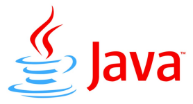

# Master's Degree Thesis and Source Code  

Subject: Dynamic profiling and inlining of methods inside the Open Source Java Virtual Machine SableVM.  

This Java Virtual Machine (JVM) was programmed in C. My project consisted into adding a module that allowed to profile the bytecode executed on the JVM and identify the most common paths of execution and then dynamically optimize the execution by inlining the most common methods (removing invoke calls) and also optimizing the code for the most common path is if-else statements.  

[Thesis (in French)](Thesis.pdf)  
[Source Code](svm-partial-inlining)  

